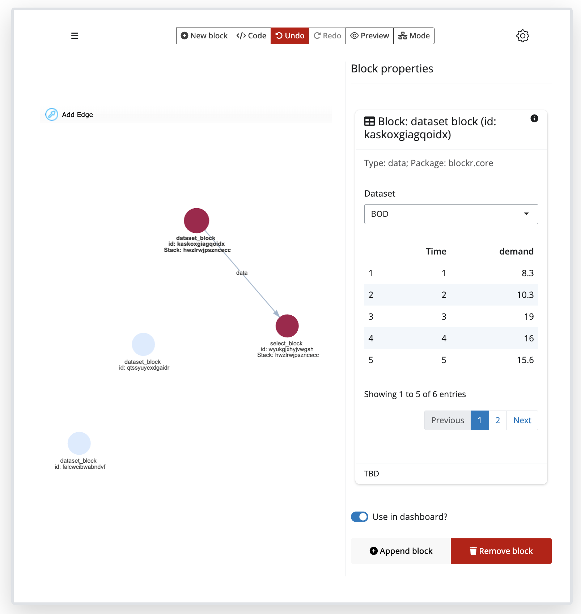

<!-- README.md is generated from README.Rmd. Please edit that file -->

# blockr.core

<!-- badges: start -->

[](https://lifecycle.r-lib.org/articles/stages.html#experimental)
[](https://github.com/cynkra/blockr.core/actions/workflows/ci.yaml)
[](https://codecov.io/gh/cynkra/blockr.core)
<!-- badges: end -->

## Overview

blockr is a framework for **data analysis**, using a **web-based** point
and click user interface. Use blockr to create web apps that perform
**visual programming**, leveraging the power of **R**.

## What is a block?

A **block** is a fundamental unit of a data analysis workflow. A single
block performs a single **task**, such as loading or filtering or
visualisation. Blocks can be joined together using a **DAG** (direct
acyclic graph) to create powerful data **workflows**.

## Who is it for?

blockr targets two main user groups:

- **non technical** users are empowered to create insightful data
  workflows using pre-built blocks that can be **easily** connected, all
  without writing a single line of code.
- **developers** are provided with a set of tools to seamlessly create
  new blocks, thereby enhancing the entire framework and fostering
  **collaboration** within organizations teams.

## What is blockr.core

`blockr.core` is the entry point to blockr, providing the core
functionality needed to get started. It can be run as a stand-alone app,
but is designed with extensibility in mind. A rich **API** is provided
to connect your own blocks and override the default behaviours (e.g.,
you can add your own GUI layer or serialisation).

## Key features

1.  **User-Friendly Interface**: Build data pipelines with intuitive
    interface, like with
    [blockr.ui](https://cynkra.github.io/blockr.ui/).
2.  **Flexibility**: Easily add, remove, or rearrange blocks in your
    pipeline.
3.  **Extensibility**: Developers can create custom blocks to extend
    functionality
    ([blockr.dplyr](https://github.com/cynkra/blockr.dplyr),
    [blockr.ai](https://github.com/cynkra/blockr.ai),
    [blockr.io](https://github.com/cynkra/blockr.io),
    [blockr.sdtm](https://github.com/cynkra/blockr.sdtm), …)
4.  **Reproducibility**: Pipelines created with `blockr.core` are easily
    shareable and reproducible, with exportable code.
5.  **Interactivity**: Real-time feedback as you build and modify your
    pipeline.

<div class="figure" style="text-align: center">


<p class="caption">

blockr.ui example
</p>

</div>

### The blockr ecosystem

We started to build blockr extensions to enrich blockr.core’s
capabilities:

- [blockr.dplyr](https://github.com/cynkra/blockr.dplyr): an entry point
  to the `dplyr` ecosystem.
- [blockr.ai](https://github.com/cynkra/blockr.ai): LLM-powered blocks.
- [blockr.io](https://github.com/cynkra/blockr.io): handle different
  data input format (xpt, csv, …) and output for export.
- [blockr.sdtm](https://github.com/cynkra/blockr.sdtm): pharmaverse
  datasets blocks.

If you wish to learn to develop your own blocks, have a look at this
[vignette](https://cynkra.github.io/blockr.core/articles/create-block.html).

## Installation

You can install the development version of blockr.core from
[GitHub](https://github.com/) with:

``` r
pak::pak("cynkra/blockr.core")
```

## How to get started?

To get started, we invite you to read this
[vignette](https://cynkra.github.io/blockr.core/articles/get-started.html).
